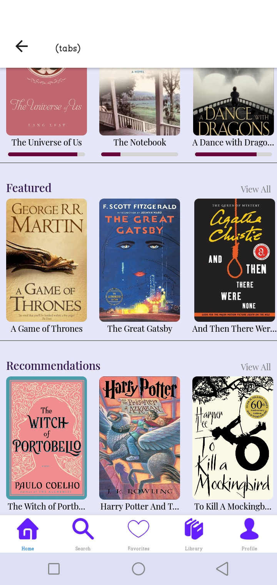

# Fabula
Fabula Mobile App

# Features
* Customizable Reading Interface
* Offline Reading Mode
* Subscription and Bundle Options
* Analytics and Reading Insights

# Course Overview
* Basic React Native Components
* User Registration & Authenticaiton
* Deployment

# Tech Stack
* React Native
* Expo Go
* HTML, CSS and JS

# Onboarding Screen
  

# Sign Up Screen
  

# Sign In Screen
  

# Home Screen

# Search Screen

# Favorites Screen

# Library Screens
* Currently Reading

* Downloads

# Profile Screen

# Screen Recording of the App
* Link is provided below:
[Watch the video on YouTube](https://youtu.be/r0nAVUT-4cQ?si=Ji7ftrf6d1y6dicp)